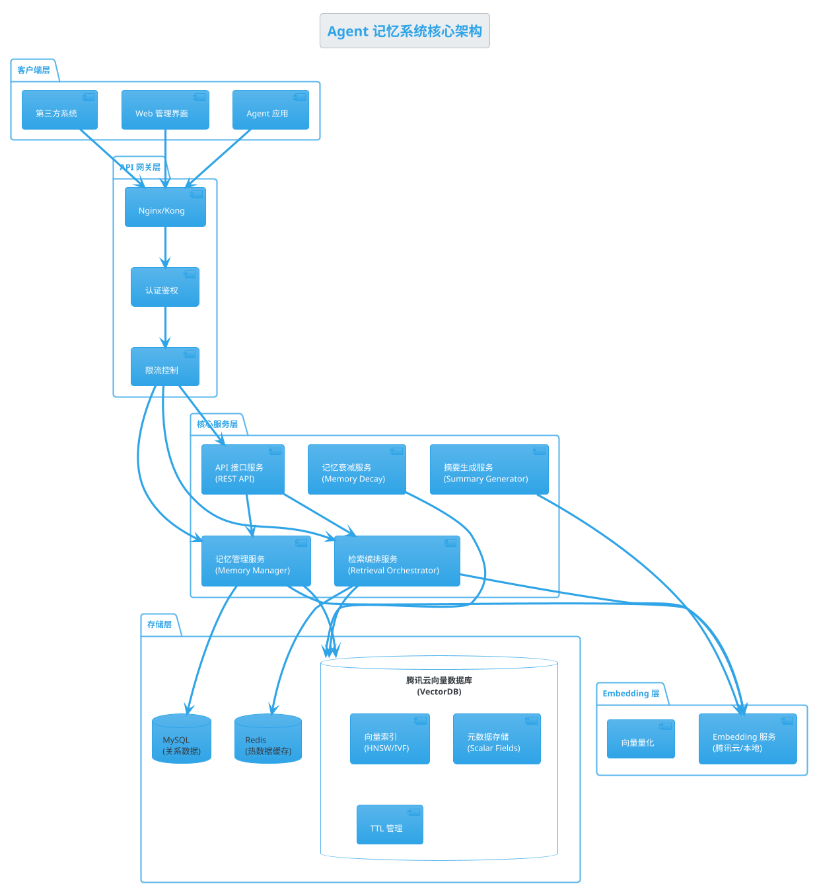
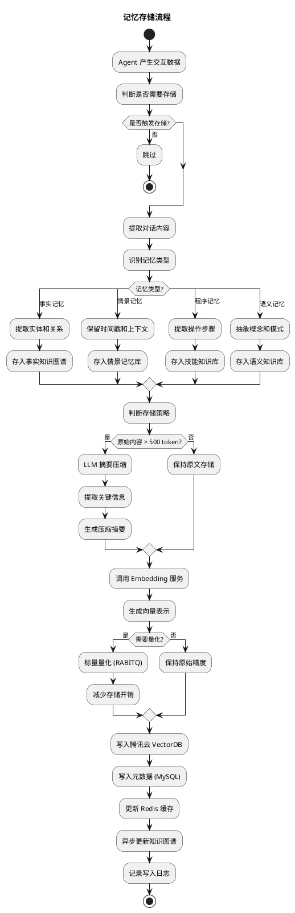
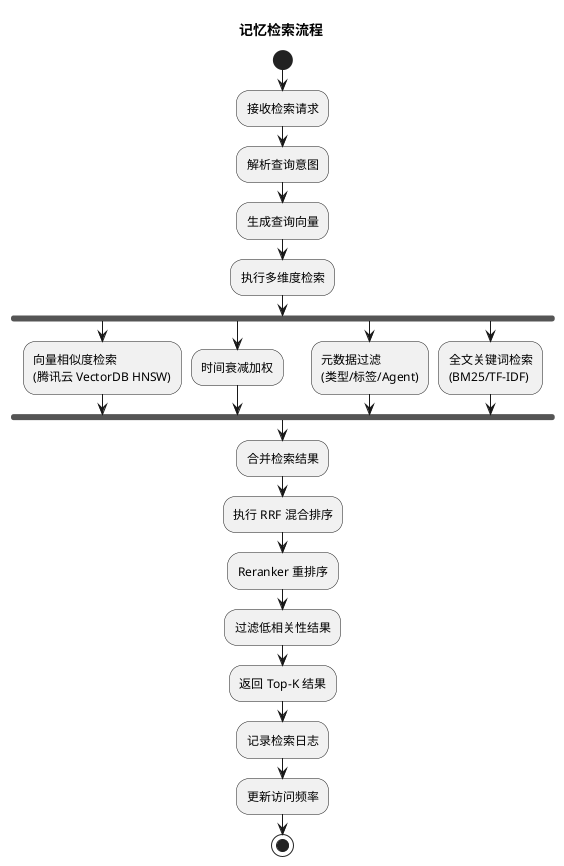
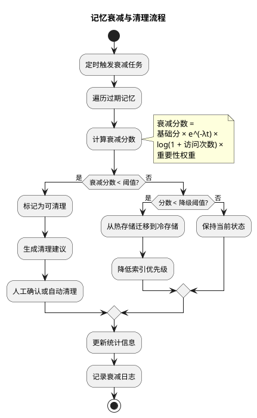
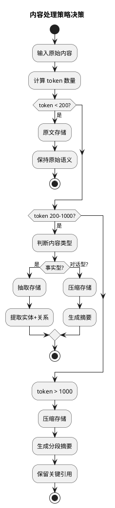
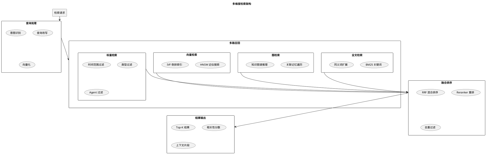

# Agent 记忆系统深度技术调研与设计方案

> 基于腾讯云向量数据库的企业级 Agent 记忆系统技术设计  
> 版本: v2.0 | 更新时间: 2026-05-27

---

## 目录

- [1. 背景与目标](#1-背景与目标)
- [2. 核心架构设计（PlantUML）](#2-核心架构设计plantuml)
- [3. 系统流程图（PlantUML）](#3-系统流程图plantuml)
- [4. 存储逻辑详解](#4-存储逻辑详解)
  - [4.1 何时存储：触发时机决策矩阵](#41-何时存储触发时机决策矩阵)
  - [4.2 存储什么：内容处理策略](#42-存储什么内容处理策略)
  - [4.3 存储方式：分层存储架构](#43-存储方式分层存储架构)
  - [4.4 存储时机：异步写入与批处理](#44-存储时机异步写入与批处理)
- [5. 查询逻辑详解](#5-查询逻辑详解)
  - [5.1 多维度检索架构](#51-多维度检索架构)
  - [5.2 相似度算法实现原理](#52-相似度算法实现原理)
  - [5.3 腾讯云向量数据库索引机制](#53-腾讯云向量数据库索引机制)
  - [5.4 混合检索与重排序](#54-混合检索与重排序)
- [6. API 接口设计](#6-api-接口设计)
  - [6.1 接口总览](#61-接口总览)
  - [6.2 存储类接口](#62-存储类接口)
  - [6.3 检索类接口](#63-检索类接口)
  - [6.4 管理类接口](#64-管理类接口)
  - [6.5 认证与限流](#65-认证与限流)
- [7. 腾讯云向量数据库集成方案](#7-腾讯云向量数据库集成方案)
- [8. 技术选型与对比](#8-技术选型与对比)
- [9. 部署架构与运维](#9-部署架构与运维)
- [10. 实施路线图](#10-实施路线图)

---

## 1. 背景与目标

### 1.1 问题定义

当前 Agent 系统面临的核心挑战：

| 挑战 | 描述 | 影响 |
|------|------|------|
| 上下文窗口限制 | LLM 单次对话的 token 上限 | 长对话丢失早期关键信息 |
| 无状态设计缺陷 | 每次对话独立，无法积累经验 | 重复询问相同偏好 |
| 语义检索低效 | 简单关键词匹配无法理解意图 | 检索结果不精准 |
| 多 Agent 协作断裂 | 独立 Agent 之间无法共享记忆 | 任务交接丢失上下文 |

### 1.2 设计目标

```
┌─────────────────────────────────────────────────────────┐
│                    Agent 记忆系统目标                       │
├─────────────────────────────────────────────────────────┤
│  ✓ 长期记忆持久化    支持跨会话、跨 Agent 的记忆存储       │
│  ✓ 语义级检索       基于向量相似度的智能检索               │
│  ✓ 多维度查询       时间/类型/重要性/关联性多维过滤        │
│  ✓ 对外 API 服务    标准化 RESTful 接口供外部系统调用      │
│  ✓ 腾讯云集成       利用企业级向量数据库保障性能与可靠性   │
│  ✓ 记忆自动衰减     基于时间衰减和访问频率的智能遗忘       │
└─────────────────────────────────────────────────────────┘
```

---

## 2. 核心架构设计（PlantUML）



### 2.1 架构分层说明

| 层级 | 组件 | 职责 |
|------|------|------|
| **客户端层** | Agent 应用、Web UI、第三方系统 | 记忆的消费者，通过 API 交互 |
| **API 网关层** | Nginx/Kong、认证鉴权、限流 | 统一入口，安全防护 |
| **核心服务层** | 记忆管理、检索编排、摘要生成、衰减 | 业务逻辑处理 |
| **存储层** | 腾讯云 VectorDB、Redis、MySQL | 数据持久化与缓存 |
| **Embedding 层** | Embedding 服务、向量量化 | 文本向量化 |

---

## 3. 系统流程图（PlantUML）

### 3.1 记忆存储流程



### 3.2 记忆检索流程



### 3.3 记忆衰减与清理流程



---

## 4. 存储逻辑详解

### 4.1 何时存储：触发时机决策矩阵

| 触发场景 | 触发条件 | 优先级 | 存储类型 |
|----------|----------|--------|----------|
| **显式记忆请求** | 用户说"记住这个" | P0（立即） | 情景记忆 + 语义记忆 |
| **偏好识别** | 检测到用户偏好的表述模式 | P1（高） | 语义记忆 |
| **重要事实** | 包含人名/地名/日期/数字的陈述 | P1（高） | 事实记忆 |
| **任务完成** | Agent 完成一个完整任务步骤 | P2（中） | 程序记忆 |
| **错误与纠正** | 用户纠正 Agent 的错误 | P0（立即） | 纠错记忆 |
| **对话结束** | 会话结束时的摘要 | P3（低） | 情景记忆 |
| **周期性快照** | 每 N 轮对话自动快照 | P3（低） | 情景记忆 |

**触发决策算法：**

```python
def should_store(conversation_context: Context) -> StoreDecision:
    """基于多因素决策的记忆存储触发算法"""
    
    # 1. 显式触发（最高优先级）
    if context.has_explicit_memory_request:
        return StoreDecision(immediate=True, type="explicit")
    
    # 2. 语义重要性评分
    importance_score = calculate_importance(context)
    
    # 3. 信息密度检测（避免存储废话）
    info_density = calculate_information_density(context)
    
    # 4. 重复度检测（避免冗余存储）
    redundancy_score = check_redundancy(context, existing_memories)
    
    # 综合评分
    final_score = (
        0.4 * importance_score +
        0.3 * info_density +
        0.3 * (1 - redundancy_score)
    )
    
    if final_score > 0.6:
        return StoreDecision(immediate=False, type="auto", score=final_score)
    else:
        return StoreDecision(immediate=False, type="skip", score=final_score)
```

### 4.2 存储什么：内容处理策略

#### 4.2.1 三种存储模式对比

| 模式 | 处理方式 | 适用场景 | 存储开销 | 检索质量 |
|------|----------|----------|----------|----------|
| **原文存储** | 保持原始文本，不做处理 | 短文本（<200 token）、关键指令 | 高 | 原始语义完整 |
| **抽取存储** | LLM 提取关键实体和关系 | 事实性信息、结构化知识 | 低 | 精确但可能丢失上下文 |
| **压缩存储** | LLM 生成摘要 | 长对话、复杂情景 | 中 | 平衡存储与语义 |

#### 4.2.2 内容处理决策树



#### 4.2.3 存储内容结构

```json
{
  "memory_id": "mem_abc123",
  "type": "episodic",
  "content": {
    "original": "用户提到喜欢使用 VS Code 作为主要 IDE，偏好暗色主题...",
    "compressed": "用户偏好：VS Code IDE + 暗色主题",
    "extracted": {
      "entities": ["VS Code", "暗色主题"],
      "relations": [("用户", "偏好", "VS Code")],
      "importance": 0.8
    }
  },
  "metadata": {
    "agent_id": "agent_001",
    "session_id": "sess_xyz",
    "created_at": "2026-05-27T10:30:00Z",
    "access_count": 5,
    "last_accessed": "2026-05-27T15:00:00Z",
    "importance_score": 0.8,
    "tags": ["偏好", "IDE", "工具"]
  },
  "vector": [0.12, -0.45, 0.78, ...],
  "ttl": "2026-06-27T10:30:00Z"
}
```

### 4.3 存储方式：分层存储架构

```
┌─────────────────────────────────────────────────────────────┐
│                     分层存储架构                              │
├─────────────────────────────────────────────────────────────┤
│                                                             │
│  热存储 (Hot)                                               │
│  ├── Redis Cluster                                          │
│  ├── 访问延迟: <1ms                                         │
│  ├── 存储: 最近 7 天 + 高频访问记忆                          │
│  └── 容量: GB 级别                                           │
│                                                             │
│  温存储 (Warm)                                              │
│  ├── 腾讯云向量数据库 (VectorDB)                             │
│  ├── 访问延迟: 5-50ms                                       │
│  ├── 存储: 30 天内所有记忆                                   │
│  └── 容量: TB 级别                                           │
│                                                             │
│  冷存储 (Cold)                                              │
│  ├── 腾讯云 COS + 归档存储                                   │
│  ├── 访问延迟: 秒级                                         │
│  ├── 存储: 30 天以上的过期记忆                               │
│  └── 容量: PB 级别                                           │
│                                                             │
└─────────────────────────────────────────────────────────────┘
```

**分层迁移策略：**

| 生命周期阶段 | 存储位置 | 触发条件 | 迁移动作 |
|--------------|----------|----------|----------|
| 新创建 | Redis + VectorDB | 写入时 | 同时写入热存储和温存储 |
| 温数据 | VectorDB | 创建 >7天 或 访问频率下降 | 从 Redis 移除，保留在 VectorDB |
| 冷数据 | COS 归档 | 创建 >30天 且 访问频率 <2次/月 | 从 VectorDB 移除，压缩归档 |
| 过期清理 | 删除 | 超过 TTL 且 重要性 <0.3 | 彻底删除 |

### 4.4 存储时机：异步写入与批处理

#### 4.4.1 写入模式

| 模式 | 实现方式 | 适用场景 | 延迟 |
|------|----------|----------|------|
| **同步写入** | HTTP 直接写入 | P0 级别显式记忆 | 100-300ms |
| **异步写入** | 消息队列 + Worker | P1-P2 级别自动记忆 | 异步，无感知 |
| **批量写入** | 定时批量聚合 | P3 级别对话摘要 | 批量处理 |

#### 4.4.2 异步写入架构

```
┌──────────────┐     ┌──────────────┐     ┌──────────────┐
│   Agent      │────▶│  消息队列     │────▶│  Worker      │
│   (生产者)   │     │  (Kafka)     │     │  (消费者)    │
└──────────────┘     └──────────────┘     └──────────────┘
                          │                     │
                          ▼                     ▼
                     ┌──────────────┐     ┌──────────────┐
                     │  待处理队列   │     │  写入 VectorDB│
                     │  (Redis)     │     │  + MySQL     │
                     └──────────────┘     └──────────────┘
```

**批量写入优化：**

```python
class BatchWriter:
    """批量写入优化器"""
    
    def __init__(self, batch_size=100, flush_interval=30):
        self.batch_size = batch_size
        self.flush_interval = flush_interval
        self.buffer = []
        self.last_flush = time.time()
    
    async def write(self, memory: Memory):
        """添加到批量缓冲区"""
        self.buffer.append(memory)
        
        if (len(self.buffer) >= self.batch_size or 
            time.time() - self.last_flush > self.flush_interval):
            await self.flush()
    
    async def flush(self):
        """批量刷写到 VectorDB"""
        if not self.buffer:
            return
            
        batch = self.buffer[:self.batch_size]
        self.buffer = self.buffer[self.batch_size:]
        
        # 批量向量化
        vectors = await self.embedding_service.batch_embed(
            [m.content for m in batch]
        )
        
        # 批量写入腾讯云 VectorDB
        await self.vectordb.batch_insert(
            collection="agent_memories",
            documents=[m.to_dict() for m in batch],
            vectors=vectors
        )
        
        self.last_flush = time.time()
```

---

## 5. 查询逻辑详解

### 5.1 多维度检索架构



### 5.2 相似度算法实现原理

#### 5.2.1 余弦相似度 (Cosine Similarity)

**原理：** 衡量两个向量方向的相似性，忽略长度差异。

**公式：**
```
cos(A, B) = (A · B) / (||A|| × ||B||)
```

**几何意义：**

```
          B
         /
        / θ
       /_______ A

cos(θ) = 1.0  → 完全相同方向（最相似）
cos(θ) = 0.0  → 正交（无关）
cos(θ) = -1.0 → 完全相反（最不相似）
```

**Python 实现：**

```python
import numpy as np

def cosine_similarity(a: np.ndarray, b: np.ndarray) -> float:
    """计算余弦相似度"""
    dot_product = np.dot(a, b)
    norm_a = np.linalg.norm(a)
    norm_b = np.linalg.norm(b)
    return dot_product / (norm_a * norm_b)
```

**适用场景：** 文本语义检索（最常用），因为 Embedding 向量的方向编码语义信息。

#### 5.2.2 欧氏距离 (Euclidean Distance)

**原理：** 衡量两个向量在空间中的直线距离。

**公式：**
```
d(A, B) = √(Σ(Ai - Bi)²)
```

**与相似度的转换：**
```
similarity = 1 / (1 + distance)
```

**Python 实现：**

```python
def euclidean_distance(a: np.ndarray, b: np.ndarray) -> float:
    """计算欧氏距离"""
    return np.sqrt(np.sum((a - b) ** 2))
```

**适用场景：** 精确空间距离计算，适用于低维特征空间。

#### 5.2.3 点积相似度 (Dot Product)

**原理：** 两个向量的元素逐项相乘后求和。

**公式：**
```
dot(A, B) = Σ(Ai × Bi)
```

**注意：** 点积受向量长度影响，需要确保向量已归一化。

**适用场景：** 当 Embedding 模型输出已归一化时，等价于余弦相似度。

#### 5.2.4 汉明距离 (Hamming Distance)

**原理：** 衡量两个二进制向量不同位的数量。

**适用场景：** 二值化向量检索（如局部敏感哈希 LSH）。

#### 5.2.5 算法对比表

| 算法 | 计算复杂度 | 适用场景 | 精度 | 速度 |
|------|------------|----------|------|------|
| 余弦相似度 | O(n) | 语义检索（首选） | 高 | 中 |
| 欧氏距离 | O(n) | 空间距离 | 高 | 中 |
| 点积 | O(n) | 归一化向量 | 高 | 快 |
| 汉明距离 | O(n/64) | 二值向量 | 低 | 极快 |

### 5.3 腾讯云向量数据库索引机制

#### 5.3.1 支持的索引类型

| 索引类型 | 原理 | 适用规模 | 查询速度 | 存储开销 |
|----------|------|----------|----------|----------|
| **FLAT** | 暴力搜索，遍历所有向量 | <10万 | 慢 | 无额外开销 |
| **HNSW** | 层次化可导航小世界图 | 10万-1亿 | 极快 | 高（2x-3x） |
| **IVF_FLAT** | 倒排索引 + FLAT | 100万-10亿 | 快 | 中等 |
| **IVF_SQ8** | 倒排索引 + 标量量化 | 1000万-10亿 | 极快 | 低（0.25x） |
| **IVF_RABITQ** | 倒排索引 + RABITQ 量化 | 1亿-100亿 | 极快 | 极低（0.1x） |

#### 5.3.2 HNSW 索引详解

**HNSW (Hierarchical Navigable Small World)** 是腾讯云向量数据库的默认推荐索引。

**核心思想：** 构建多层图结构，每层是一个小世界图，高层稀疏用于快速定位，低层稠密用于精确搜索。

**构建过程：**

```
Layer 3:  A ───────────── D
          │               │
Layer 2:  A ──── B ────── D ──── E
          │     │         │
Layer 1:  A ── B ── C ── D ── E ── F
          │  │  │  │  │  │  │  │
Layer 0:  A──B──C──D──E──F──G──H (全连接层)
```

**查询过程：**

```python
def hnsw_search(query: Vector, entry_point: Node, layer: int) -> List[Node]:
    """HNSW 搜索算法"""
    current = entry_point
    
    # 从最高层开始，逐层下降
    for l in range(max_layer, -1, -1):
        # 在当前层找到最近邻
        current = greedy_search(query, current, l)
    
    # 在底层执行精确搜索
    candidates = beam_search(query, current, layer=0, beam_width=16)
    
    return candidates[:top_k]
```

**关键参数：**

| 参数 | 含义 | 推荐值 | 影响 |
|------|------|--------|------|
| M | 每层连接数 | 16-64 | 越大查询越精确，构建越慢 |
| efConstruction | 构建时搜索宽度 | 128-256 | 越大索引质量越高 |
| efSearch | 查询时搜索宽度 | 64-128 | 越大查询越精确 |

#### 5.3.3 IVF 系列索引详解

**IVF (Inverted File Index)** 通过聚类将向量空间分区，查询时只搜索最近的几个分区。

**构建过程：**

```
1. 使用 K-Means 将向量聚成 N 个簇 (Voronoi cells)
2. 每个簇维护一个倒排列表
3. 查询时先定位最近簇，再在簇内搜索
```

**RABITQ 量化优化：**

```
原始向量 (768维 × 32位)  →  768 × 32 = 24,576 bits
RABITQ 量化后            →  768 × 2 = 1,536 bits (压缩 16x)
```

**适用场景：** 超大规模数据（10亿级），对存储成本敏感。

### 5.4 混合检索与重排序

#### 5.4.1 RRF (Reciprocal Rank Fusion) 混合排序

**原理：** 将多路召回的结果通过排名倒数融合为统一排序。

**公式：**
```
RRF_score(d) = Σ 1/(k + rank_i(d))

其中 k = 60（常数），rank_i(d) 是文档 d 在第 i 路召回中的排名
```

**Python 实现：**

```python
def reciprocal_rank_fusion(
    result_lists: List[List[Document]], 
    k: int = 60
) -> List[Document]:
    """RRF 混合排序"""
    doc_scores = defaultdict(float)
    
    for results in result_lists:
        for rank, doc in enumerate(results):
            doc_scores[doc.id] += 1.0 / (k + rank + 1)
    
    sorted_docs = sorted(doc_scores.items(), key=lambda x: x[1], reverse=True)
    return [doc_id for doc_id, score in sorted_docs]
```

#### 5.4.2 Reranker 重排序

**Cross-Encoder 重排序流程：**

```
Query: "用户喜欢什么编程语言?"
    ↓
候选文档: ["Python", "Java", "JavaScript"]
    ↓
Cross-Encoder 编码: (Query, Doc) → 相关性分数
    ↓
重排序: Python(0.92) > JavaScript(0.78) > Java(0.65)
```

**推荐模型：**

| 模型 | 精度 | 速度 | 适用场景 |
|------|------|------|----------|
| bge-reranker-v2-m3 | 高 | 中 | 多语言场景 |
| cross-encoder/ms-marco-MiniLM-L-6-v2 | 中 | 快 | 轻量级场景 |
| bge-reranker-large | 极高 | 慢 | 高精度要求 |

---

## 6. API 接口设计

### 6.1 接口总览

| 接口组 | 前缀 | 描述 |
|--------|------|------|
| 存储类 | `/api/v1/memory` | 记忆的增删改查 |
| 检索类 | `/api/v1/retrieve` | 多维度检索 |
| 管理类 | `/api/v1/admin` | 系统管理与配置 |
| 健康检查 | `/api/v1/health` | 服务状态 |

### 6.2 存储类接口

#### 6.2.1 创建记忆

```http
POST /api/v1/memory
Content-Type: application/json
Authorization: Bearer <token>

{
  "agent_id": "agent_001",
  "type": "episodic",
  "content": "用户提到喜欢使用 VS Code 作为主要 IDE",
  "metadata": {
    "session_id": "sess_xyz",
    "tags": ["偏好", "IDE"],
    "importance": 0.8
  },
  "options": {
    "processing_mode": "auto",
    "enable_compression": true,
    "ttl_days": 90
  }
}
```

**响应：**

```json
{
  "success": true,
  "data": {
    "memory_id": "mem_abc123",
    "vector_id": "vec_789",
    "processing": {
      "mode": "compressed",
      "original_tokens": 180,
      "compressed_tokens": 45,
      "compression_ratio": 4.0
    },
    "created_at": "2026-05-27T10:30:00Z"
  }
}
```

#### 6.2.2 批量创建记忆

```http
POST /api/v1/memory/batch
Content-Type: application/json
Authorization: Bearer <token>

{
  "agent_id": "agent_001",
  "memories": [
    {
      "type": "semantic",
      "content": "用户偏好暗色主题"
    },
    {
      "type": "factual",
      "content": "用户工作于腾讯云团队"
    }
  ]
}
```

#### 6.2.3 获取记忆

```http
GET /api/v1/memory/{memory_id}
Authorization: Bearer <token>
```

#### 6.2.4 更新记忆

```http
PUT /api/v1/memory/{memory_id}
Content-Type: application/json
Authorization: Bearer <token>

{
  "metadata": {
    "importance": 0.9,
    "tags": ["偏好", "IDE", "高频"]
  }
}
```

#### 6.2.5 删除记忆

```http
DELETE /api/v1/memory/{memory_id}
Authorization: Bearer <token>
```

### 6.3 检索类接口

#### 6.3.1 语义检索

```http
POST /api/v1/retrieve/semantic
Content-Type: application/json
Authorization: Bearer <token>

{
  "query": "用户喜欢什么开发工具?",
  "agent_id": "agent_001",
  "options": {
    "top_k": 10,
    "similarity_threshold": 0.7,
    "search_type": "hybrid",
    "rerank": true,
    "filters": {
      "type": ["episodic", "semantic"],
      "tags": ["偏好"],
      "time_range": {
        "start": "2026-01-01T00:00:00Z",
        "end": "2026-05-27T23:59:59Z"
      }
    }
  }
}
```

**响应：**

```json
{
  "success": true,
  "data": {
    "query": "用户喜欢什么开发工具?",
    "results": [
      {
        "memory_id": "mem_abc123",
        "content": "用户偏好：VS Code IDE + 暗色主题",
        "original_content": "用户提到喜欢使用 VS Code 作为主要 IDE...",
        "score": 0.92,
        "score_breakdown": {
          "vector_score": 0.88,
          "bm25_score": 0.75,
          "rrf_score": 0.92
        },
        "type": "semantic",
        "created_at": "2026-05-27T10:30:00Z",
        "metadata": {
          "tags": ["偏好", "IDE"]
        }
      }
    ],
    "total": 1,
    "processing_time_ms": 45
  }
}
```

#### 6.3.2 多维度检索

```http
POST /api/v1/retrieve/multi
Content-Type: application/json
Authorization: Bearer <token>

{
  "query": "用户最近的工作项目",
  "dimensions": {
    "semantic": {
      "enabled": true,
      "weight": 0.4
    },
    "temporal": {
      "enabled": true,
      "weight": 0.3,
      "decay_function": "exponential",
      "half_life_days": 30
    },
    "importance": {
      "enabled": true,
      "weight": 0.2
    },
    "associative": {
      "enabled": true,
      "weight": 0.1,
      "hop_count": 2
    }
  },
  "filters": {
    "agent_id": "agent_001"
  },
  "top_k": 15
}
```

#### 6.3.3 相似记忆检索

```http
POST /api/v1/retrieve/similar
Content-Type: application/json
Authorization: Bearer <token>

{
  "memory_id": "mem_abc123",
  "top_k": 5,
  "exclude_self": true
}
```

#### 6.3.4 上下文检索（RAG 增强）

```http
POST /api/v1/retrieve/context
Content-Type: application/json
Authorization: Bearer <token>

{
  "query": "帮我写一个 Python 脚本",
  "agent_id": "agent_001",
  "context_config": {
    "max_tokens": 2000,
    "include_history": true,
    "history_rounds": 3,
    "include_preferences": true,
    "include_skills": true
  }
}
```

**响应（直接注入 LLM 上下文的格式）：**

```json
{
  "success": true,
  "data": {
    "context": "## 用户偏好\n- 使用 VS Code + 暗色主题\n- 偏好 Python 3.11+\n\n## 相关历史\n- 2026-05-25: 用户完成了一个数据清洗脚本\n- 2026-05-26: 用户询问了 pandas 用法\n\n## 技能记忆\n- 用户熟悉 pandas, numpy\n- 用户不熟悉 asyncio",
    "token_count": 1850,
    "memories_used": 6
  }
}
```

### 6.4 管理类接口

#### 6.4.1 统计信息

```http
GET /api/v1/admin/stats
Authorization: Bearer <token>
```

#### 6.4.2 记忆衰减触发

```http
POST /api/v1/admin/decay/trigger
Authorization: Bearer <token>

{
  "mode": "full",
  "dry_run": false
}
```

#### 6.4.3 向量重建

```http
POST /api/v1/admin/reindex
Authorization: Bearer <token>

{
  "collection": "agent_memories",
  "index_type": "HNSW",
  "parameters": {
    "M": 32,
    "efConstruction": 256
  }
}
```

### 6.5 认证与限流

#### 6.5.1 认证方式

| 方式 | Header | 说明 |
|------|--------|------|
| Bearer Token | `Authorization: Bearer <token>` | 主要方式 |
| API Key | `X-API-Key: <key>` | 第三方集成 |

#### 6.5.2 限流策略

| 接口组 | 限流策略 | 说明 |
|--------|----------|------|
| 存储类 | 100 QPS / Agent | 防止写入过快 |
| 检索类 | 500 QPS / Agent | 支持高并发查询 |
| 管理类 | 10 QPS / Agent | 低频管理操作 |

---

## 7. 腾讯云向量数据库集成方案

### 7.1 产品选型

| 产品 | 版本 | 适用场景 | 推荐规格 |
|------|------|----------|----------|
| **腾讯云向量数据库 (基础版)** | VectorDB | 通用场景 | 4核8G，50GB存储 |
| **腾讯云向量数据库 (企业版)** | VectorDB Enterprise | 高可用要求 | 8核16G，200GB存储 |
| **腾讯云 Elasticsearch** | ES 8.x | 需要全文+向量混合检索 | 4核16G，100GB存储 |

### 7.2 连接配置

```python
# 腾讯云向量数据库 Python SDK 配置
from tencentcloud vectordb import VectorDBClient

class TencentVectorDB:
    def __init__(self):
        self.client = VectorDBClient(
            credential={
                "secret_id": os.getenv("TENCENT_SECRET_ID"),
                "secret_key": os.getenv("TENCENT_SECRET_KEY")
            },
            region="ap-guangzhou",
            profile={
                "httpProfile": {
                    "endpoint": "vectordb.tencentcloudapi.com"
                }
            }
        )
    
    async def create_collection(self, collection_name: str):
        """创建集合"""
        params = {
            "CollectionName": collection_name,
            "Dimension": 1024,
            "IndexType": "HNSW",
            "MetricType": "COSINE",
            "HNSWParams": {
                "M": 32,
                "efConstruction": 256
            },
            "ShardCount": 3,
            "ReplicaCount": 2,
            "TTL": 90 * 24 * 3600  # 90天 TTL
        }
        return await self.client.create_collection(params)
    
    async def insert(self, collection_name: str, documents: List[dict]):
        """批量插入"""
        params = {
            "CollectionName": collection_name,
            "Documents": documents
        }
        return await self.client.insert(params)
    
    async def search(
        self, 
        collection_name: str, 
        query_vector: List[float],
        top_k: int = 10,
        filter: str = None
    ):
        """向量检索"""
        params = {
            "CollectionName": collection_name,
            "QueryVector": query_vector,
            "TopK": top_k,
            "OutputFields": ["content", "metadata", "created_at"],
            "Filter": filter
        }
        return await self.client.search(params)
```

### 7.3 索引配置策略

| 场景 | 索引类型 | M/ef | 理由 |
|------|----------|------|------|
| 小规模 (<10万) | HNSW | M=16, ef=128 | 查询速度优先 |
| 中规模 (10万-1000万) | HNSW | M=32, ef=256 | 平衡精度与速度 |
| 大规模 (>1000万) | IVF_SQ8 | nlist=1024 | 存储成本优先 |
| 超大规模 (>1亿) | IVF_RABITQ | nlist=4096 | 极致压缩 |

---

## 8. 技术选型与对比

### 8.1 向量数据库对比

| 特性 | 腾讯云 VectorDB | Milvus | Weaviate | Pinecone |
|------|-----------------|--------|----------|----------|
| 部署方式 | 云托管 | 自建/云 | 自建/云 | 云托管 |
| 索引类型 | FLAT/HNSW/IVF | FLAT/HNSW/IVF/DISK | HNSW | HNSW |
| 最大向量数 | 10亿+ | 10亿+ | 1亿+ | 10亿+ |
| 混合检索 | ✓ | ✓ | ✓ | 有限 |
| TTL 支持 | ✓ 原生 | ✓ | ✓ | ✓ |
| 价格 | 中 | 低(自建) | 低(自建) | 高 |

### 8.2 Embedding 模型对比

| 模型 | 维度 | 中文支持 | 速度 | 精度 |
|------|------|----------|------|------|
| text-embedding-3-large | 3072 | 一般 | 中 | 高 |
| BAAI/bge-large-zh | 1024 | 优秀 | 中 | 高 |
| 腾讯云 Embedding | 1024 | 优秀 | 快 | 高 |
| jinaai/jina-embeddings-v3 | 1024 | 优秀 | 快 | 高 |

---

## 9. 部署架构与运维

### 9.1 部署拓扑

```
┌─────────────────────────────────────────────────────────────┐
│                      生产环境部署                            │
├─────────────────────────────────────────────────────────────┤
│                                                             │
│  ┌─────────────┐     ┌─────────────┐     ┌─────────────┐  │
│  │  Agent A    │     │  Agent B    │     │  Agent C    │  │
│  └──────┬──────┘     └──────┬──────┘     └──────┬──────┘  │
│         │                   │                   │          │
│         └───────────────────┼───────────────────┘          │
│                             │                              │
│                    ┌────────▼────────┐                     │
│                    │   API Gateway   │                     │
│                    │   (Kong/Nginx)  │                     │
│                    └────────┬────────┘                     │
│                             │                              │
│              ┌──────────────┼──────────────┐               │
│              │              │              │               │
│     ┌────────▼───┐  ┌──────▼─────┐  ┌────▼────────┐     │
│     │ Memory API │  │ Retrieval  │  │ Decay       │     │
│     │ Service    │  │ Service    │  │ Service     │     │
│     └────────┬───┘  └──────┬─────┘  └────┬────────┘     │
│              │              │              │               │
│              └──────────────┼──────────────┘               │
│                             │                              │
│              ┌──────────────┼──────────────┐               │
│              │              │              │               │
│     ┌────────▼───┐  ┌──────▼─────┐  ┌────▼────────┐     │
│     │ Redis      │  │ Tencent    │  │ MySQL       │     │
│     │ Cluster    │  │ VectorDB   │  │             │     │
│     └────────────┘  └────────────┘  └─────────────┘     │
│                                                             │
└─────────────────────────────────────────────────────────────┘
```

### 9.2 监控指标

| 指标类别 | 具体指标 | 告警阈值 |
|----------|----------|----------|
| **延迟** | P99 检索延迟 | >200ms |
| **吞吐** | QPS 峰值 | >80% 容量 |
| **准确率** | 检索相关性 | <0.7 |
| **存储** | VectorDB 磁盘使用率 | >80% |
| **缓存** | Redis 命中率 | <90% |

---

## 10. 实施路线图

| 阶段 | 周期 | 目标 | 交付物 |
|------|------|------|--------|
| **P0: 基础搭建** | 2 周 | 核心存储 + 基础检索 | 基础 API + VectorDB 集成 |
| **P1: 检索增强** | 2 周 | 混合检索 + Reranker | 多维度检索 API |
| **P2: 记忆管理** | 2 周 | 衰减 + 清理 + 分层 | 记忆生命周期管理 |
| **P3: 生产优化** | 2 周 | 性能优化 + 监控 | 生产就绪版本 |

---

## 参考资料

1. 腾讯云向量数据库官方文档: https://cloud.tencent.com/document/product/1709
2. Mem0 - Memory Layer for AI Agents: https://github.com/mem0ai/mem0
3. Graphiti - Knowledge Graph Memory: https://github.com/getzep/graphiti
4. Letta (MemGPT) - Stateful LLM Agents: https://github.com/letta-ai/letta
5. HNSW 论文: Efficient and robust approximate nearest neighbor search using Hierarchical Navigable Small World graphs
6. RRF 论文: Reciprocal Rank Fusion outperforms Condorcet and individual Rank Learning Methods

---

*文档版本: v2.0 | 作者: AI Learning Blog | 最后更新: 2026-05-27*
