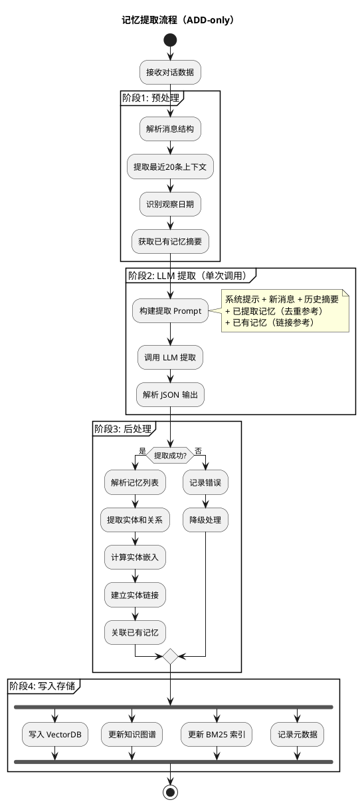
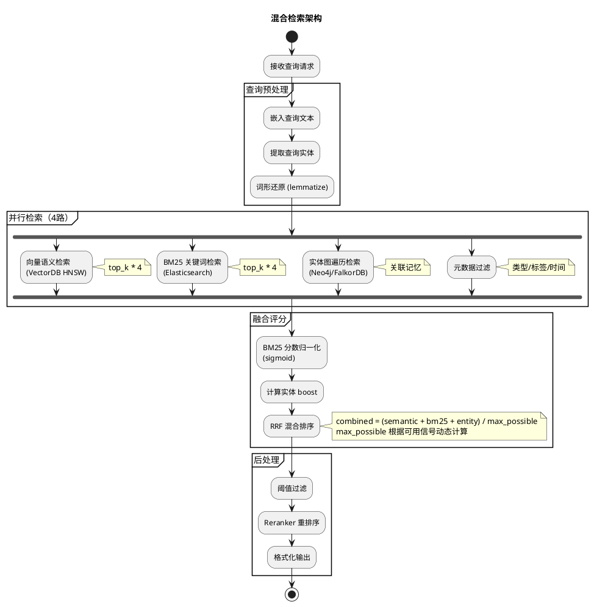
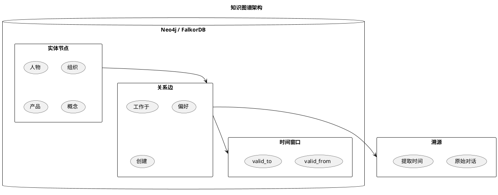

# Agent 记忆系统深度技术调研与设计方案

> 基于腾讯云向量数据库的企业级 Agent 记忆中台技术设计  
> 版本: v3.0 | 更新时间: 2026-05-27

---

## 目录

- [1. 背景与目标](#1-背景与目标)
- [2. 行业对标：Mem0/Graphiti/Letta 深度分析](#2-行业对标mem0graphitletta-深度分析)
- [3. 核心架构设计](#3-核心架构设计)
- [4. 记忆提取引擎](#4-记忆提取引擎)
- [5. 混合检索引擎](#5-混合检索引擎)
- [6. 知识图谱集成](#6-知识图谱集成)
- [7. 高并发与极端场景处理](#7-高并发与极端场景处理)
- [8. API 接口设计](#8-api-接口设计)
- [9. 前端监控界面设计](#9-前端监控界面设计)
- [10. 腾讯云集成方案](#10-腾讯云集成方案)
- [11. 部署架构](#11-部署架构)
- [12. 实施路线图](#12-实施路线图)

---

## 1. 背景与目标

### 1.1 问题定义

当前 Agent 系统面临的核心挑战：

| 挑战 | 描述 | 影响 |
|------|------|------|
| 上下文窗口限制 | LLM 单次对话的 token 上限 | 长对话丢失早期关键信息 |
| 无状态设计缺陷 | 每次对话独立，无法积累经验 | 重复询问相同偏好 |
| 语义检索低效 | 简单关键词匹配无法理解意图 | 检索结果不精准 |
| 多 Agent 协作断裂 | 独立 Agent 之间无法共享记忆 | 任务交接丢失上下文 |

### 1.2 设计目标

作为企业级**记忆中台**，需要支持：

```
┌─────────────────────────────────────────────────────────┐
│                    Agent 记忆中台目标                       │
├─────────────────────────────────────────────────────────┤
│  ✓ 长期记忆持久化    支持跨会话、跨 Agent 的记忆存储       │
│  ✓ 语义级检索       基于向量相似度的智能检索               │
│  ✓ 多维度查询       时间/类型/重要性/关联性多维过滤        │
│  ✓ 对外 API 服务    标准化 RESTful 接口供外部系统调用      │
│  ✓ 腾讯云集成       利用企业级向量数据库保障性能与可靠性   │
│  ✓ 高并发支持       万级 QPS 的读写能力                   │
│  ✓ 监控运维         完善的指标监控和告警体系               │
│  ✓ 多租户隔离       不同业务线的数据隔离                  │
└─────────────────────────────────────────────────────────┘
```

---

## 2. 行业对标：Mem0/Graphiti/Letta 深度分析

### 2.1 Mem0 v3 架构分析（GitHub 25K+ Stars）

Mem0 是目前最成熟的 Agent 记忆层项目，2026年4月发布了革命性的 v3 算法。

**核心创新点：**

| 技术特性 | 实现方式 | 我们的借鉴 |
|----------|----------|------------|
| **ADD-only 单次提取** | 一次 LLM 调用提取所有记忆，不做 UPDATE/DELETE | 采用，避免记忆覆盖 |
| **实体链接** | 实体提取 + 嵌入 + 跨记忆关联 | 集成到知识图谱层 |
| **多信号融合检索** | 语义 + BM25 + 实体 boost 并行打分 | 核心检索策略 |
| **时间感知检索** | 解析相对时间引用，锚定到绝对日期 | 必须实现 |

**Mem0 检索评分算法（源码分析）：**

```python
# Mem0 核心评分公式（简化）
combined_score = (semantic_score + bm25_score + entity_boost) / max_possible

# 其中：
# - semantic_score: HNSW 向量检索得分 [0, 1]
# - bm25_score: 关键词匹配得分，经 sigmoid 归一化 [0, 1]
# - entity_boost: 实体关联加权，最大 0.5
# - max_possible: 根据可用信号动态计算 (1.0 ~ 2.5)
```

**BM25 归一化参数（查询长度自适应）：**

| 查询词数 | Sigmoid 中点 | 陡峭度 |
|----------|-------------|--------|
| ≤3 | 5.0 | 0.7 |
| 4-6 | 7.0 | 0.6 |
| 7-9 | 9.0 | 0.5 |
| 10-15 | 10.0 | 0.5 |
| >15 | 12.0 | 0.5 |

### 2.2 Graphiti 知识图谱分析（Zep 团队）

Graphiti 是 Zep 的开源时间感知上下文图谱引擎，论文发表于 arXiv。

**核心架构：**

| 组件 | 存储内容 | 作用 |
|------|----------|------|
| **Entities（节点）** | 人物、产品、策略、概念 | 实体的摘要随时间演进 |
| **Facts/Relationships（边）** | 三元组 + 时间有效性窗口 | 追踪事实何时成立、何时被取代 |
| **Episodes（溯源）** | 原始输入数据 | 所有派生事实的源头 |
| **Custom Types（本体）** | 开发者定义的实体/边类型 | Pydantic 模型定义 |

**Graphiti vs 传统 RAG：**

| 维度 | 传统 RAG | Graphiti |
|------|----------|----------|
| 数据结构 | 扁平文档块 | 时序图结构 |
| 更新方式 | 全量重建 | 增量更新 |
| 时间感知 | 无 | 有效期窗口 |
| 关系追踪 | 无 | 实体关系图 |
| 检索方式 | 纯语义 | 语义+图遍历 |

### 2.3 Letta（原 MemGPT）分析

Letta 实现了"无限上下文窗口"的虚拟上下文管理。

**核心机制：**

- **分层记忆架构**：核心记忆 → 归档记忆 → 冻结记忆
- **主动管理**：Agent 自主决定何时存储、检索、遗忘
- **压缩策略**：LLM 摘要 + 重要性评分

---

## 3. 核心架构设计

### 3.1 系统架构图

```plantuml
@startuml Agent-Memory-Middleware
!theme cerulean
title Agent 记忆中台核心架构

package "接入层" as接入 {
  [Web 控制台] as WebUI
  [REST API] as API
  [SDK (Python/Go)] as SDK
}

package "API 网关" as网关 {
  [Kong/Nginx] as GW
  [JWT 认证] as Auth
  [限流熔断] as RateLimit
}

package "核心服务层" as核心 {
  [记忆提取服务
(Add-only Engine)] as Extractor
  [混合检索服务
(Hybrid Retrieval)] as Retriever
  [实体链接服务
(Entity Linking)] as EntityLink
  [时间推理服务
(Temporal Reasoning)] as Temporal
  [衰减清理服务
(Memory Decay)] as Decay
}

package "数据处理层" as处理 {
  [Embedding 服务
(腾讯云/本地)] as Embed
  [NER 实体提取
(spaCy/LLM)] as NER
  [BM25 索引
(Elasticsearch)] as BM25
}

package "存储层" as存储 {
  database "腾讯云 VectorDB
(HNSW 索引)" as VDB
  database "Redis Cluster
(热数据缓存)" as Redis
  database "MySQL/PostgreSQL
(元数据)" as MySQL
  database "Neo4j/FalkorDB
(知识图谱)" as Graph
  database "Elasticsearch
(全文检索)" as ES
}

package "消息队列" as队列 {
  queue "Kafka/RabbitMQ
(异步写入)" as MQ
}

WebUI --> GW
API --> GW
SDK --> GW
GW --> Auth
Auth --> RateLimit

RateLimit --> Extractor
RateLimit --> Retriever

Extractor --> Embed
Extractor --> NER
Extractor --> MQ

Retriever --> Embed
Retriever --> VDB
Retriever --> BM25
Retriever --> Graph
Retriever --> Redis

MQ --> VDB : 异步写入
MQ --> Graph : 异步更新
MQ --> MySQL : 异步记录

Decay --> VDB
Decay --> Graph

@enduml
```

### 3.2 服务职责

| 服务 | 职责 | 核心算法 |
|------|------|----------|
| 记忆提取服务 | 从对话中提取结构化记忆 | ADD-only 单次提取 + 实体识别 |
| 混合检索服务 | 多信号融合检索 | 语义 + BM25 + 实体 boost |
| 实体链接服务 | 跨记忆实体关联 | 实体嵌入 + 图遍历 |
| 时间推理服务 | 处理时间引用 | 相对时间 → 绝对日期锚定 |
| 衰减清理服务 | 记忆生命周期管理 | 指数衰减 + 重要性加权 |

---

## 4. 记忆提取引擎

### 4.1 提取流程（借鉴 Mem0 v3）



### 4.2 提取 Prompt 设计

```python
EXTRACTION_PROMPT = """
# 角色
你是记忆提取器 — 一个精确的、基于证据的处理器，负责从对话中提取丰富的、上下文相关的记忆。

# 输入
- 新消息: 当前对话轮次（用户 + 助手）
- 摘要: 用户历史档案摘要
- 已提取记忆: 本次会话已提取的记忆（去重参考）
- 已有记忆: 系统中已存在的相关记忆（链接参考）
- 观察日期: 对话发生的真实日期

# 提取规则
1. 从用户消息提取: 个人事实、偏好、计划、关系、观点
2. 从助手消息提取: 给出的建议、创建的计划、提供的解决方案
3. 时间处理: 所有相对时间引用必须锚定到观察日期
4. 去重: 如果与已有记忆语义重复，跳过
5. 链接: 如果与已有记忆相关，在 linked_memory_ids 中引用

# 输出格式
{
  "memory": [
    {
      "text": "记忆内容",
      "entities": [{"name": "实体名", "type": "实体类型"}],
      "linked_memory_ids": ["已有记忆ID"],
      "importance": 0.8,
      "created_at": "2026-05-27"
    }
  ]
}
"""
```

### 4.3 实体提取算法

Mem0 使用 spaCy 进行实体提取，我们的增强版：

```python
# 实体类型定义
ENTITY_TYPES = {
    "PERSON": "人物",
    "ORG": "组织",
    "PRODUCT": "产品",
    "LOCATION": "地点",
    "DATE": "日期",
    "PREFERENCE": "偏好",
    "SKILL": "技能",
    "PROJECT": "项目",
}

# 实体提取流程
def extract_entities(text: str, llm_client) -> List[Entity]:
    """
    混合实体提取: spaCy NER + LLM 增强
    """
    # 1. spaCy 快速提取
    doc = spacy_nlp(text)
    spacy_entities = [(ent.text, ent.label_) for ent in doc.ents]
    
    # 2. LLM 增强提取（业务实体）
    llm_prompt = f"""
    从以下文本中提取实体，包括人物、组织、产品、偏好等：
    {text}
    
    返回JSON格式: [{{"name": "...", "type": "..."}}]
    """
    llm_entities = llm_client.extract(llm_prompt)
    
    # 3. 合并去重
    return merge_and_deduplicate(spacy_entities, llm_entities)
```

### 4.4 时间感知处理

```python
def resolve_temporal_references(text: str, observation_date: datetime) -> str:
    """
    将相对时间引用锚定到绝对日期
    """
    # 示例:
    # "yesterday" → observation_date - 1 day
    # "last week" → observation_date - 7 days
    # "next month" → observation_date + 1 month
    
    resolved_text = text
    for pattern, delta in TEMPORAL_PATTERNS.items():
        if pattern in resolved_text:
            absolute_date = observation_date + delta
            resolved_text = resolved_text.replace(
                pattern, absolute_date.strftime("%Y-%m-%d")
            )
    return resolved_text
```

---

## 5. 混合检索引擎

### 5.1 检索架构



### 5.2 评分算法详解

```python
def score_and_rank(
    semantic_results: List[Dict],
    bm25_scores: Dict[str, float],
    entity_boosts: Dict[str, float],
    threshold: float,
    top_k: int,
) -> List[Dict]:
    """
    三信号融合评分
    """
    # 动态计算最大可能分数
    max_possible = 1.0  # 基础: 语义分数
    if bm25_scores:
        max_possible += 1.0  # + BM25
    if entity_boosts:
        max_possible += 0.5  # + 实体 boost
    
    scored = []
    for result in semantic_results:
        # 语义分数（必须超过阈值）
        semantic_score = result["score"]
        if semantic_score < threshold:
            continue
        
        # BM25 分数（已归一化到 [0, 1]）
        bm25_score = bm25_scores.get(result["id"], 0.0)
        
        # 实体 boost（最大 0.5）
        entity_boost = entity_boosts.get(result["id"], 0.0)
        
        # 加权融合
        combined = (semantic_score + bm25_score + entity_boost) / max_possible
        scored.append({
            "id": result["id"],
            "score": combined,
            "semantic": semantic_score,
            "bm25": bm25_score,
            "entity_boost": entity_boost,
        })
    
    # 按综合分数排序
    scored.sort(key=lambda x: x["score"], reverse=True)
    return scored[:top_k]


def normalize_bm25(raw_score: float, query_length: int) -> float:
    """
    BM25 分数归一化（查询长度自适应 sigmoid）
    """
    # 根据查询长度选择 sigmoid 参数
    if query_length <= 3:
        midpoint, steepness = 5.0, 0.7
    elif query_length <= 6:
        midpoint, steepness = 7.0, 0.6
    else:
        midpoint, steepness = 10.0, 0.5
    
    # sigmoid 归一化
    return 1.0 / (1.0 + math.exp(-steepness * (raw_score - midpoint)))
```

### 5.3 实体 Boost 计算

```python
def compute_entity_boosts(
    query_entities: List[Tuple[str, str]],  # (type, text)
    entity_store,  # 向量化的实体库
    embedding_model,
    filters: Dict,
) -> Dict[str, float]:
    """
    实体关联加权：将查询实体与记忆中的实体匹配，给予关联记忆加分
    """
    memory_boosts = {}
    ENTITY_BOOST_WEIGHT = 0.5  # 最大 boost 权重
    
    for entity_type, entity_text in query_entities[:8]:  # 最多 8 个实体
        # 嵌入实体文本
        entity_embedding = embedding_model.embed(entity_text, "search")
        
        # 在实体库中搜索
        matches = entity_store.search(
            query=entity_text,
            vectors=entity_embedding,
            top_k=500,
            filters=filters,
        )
        
        for match in matches:
            similarity = match.score
            if similarity < 0.5:  # 相似度阈值
                continue
            
            # 获取关联的记忆 ID
            linked_memory_ids = match.payload.get("linked_memory_ids", [])
            
            # 衰减计算：关联记忆越多，单个 boost 越小
            num_linked = max(len(linked_memory_ids), 1)
            weight = 1.0 / (1.0 + 0.001 * ((num_linked - 1) ** 2))
            
            boost = similarity * ENTITY_BOOST_WEIGHT * weight
            
            for memory_id in linked_memory_ids:
                memory_boosts[memory_id] = max(
                    memory_boosts.get(memory_id, 0.0), boost
                )
    
    return memory_boosts
```

---

## 6. 知识图谱集成

### 6.1 图谱架构（借鉴 Graphiti）



### 6.2 图谱节点定义

```cypher
// 实体节点
CREATE (e:Entity {
  id: "uuid",
  name: "张三",
  type: "PERSON",
  summary: "腾讯云高级工程师，专注于分布式系统",
  created_at: datetime(),
  updated_at: datetime(),
  access_count: 0,
  importance: 0.8
})

// 关系边（带时间窗口）
CREATE (e1)-[:WORKS_AT {
  valid_from: date("2024-01-01"),
  valid_to: null,  // null 表示当前有效
  confidence: 0.95,
  source_episode_id: "episode-uuid"
}]->(e2)

// Episode 节点（溯源）
CREATE (ep:Episode {
  id: "uuid",
  content: "原始对话内容...",
  source: "chat",
  created_at: datetime()
})
```

### 6.3 图遍历查询

```cypher
// 查询某人的所有当前有效关系
MATCH (p:Person {name: "张三"})-[r]->(target)
WHERE r.valid_to IS NULL
RETURN target, type(r) as relationship, r.valid_from as since

// 查询与某实体相关的所有记忆
MATCH (e:Entity {name: "项目A"})<-[:MENTIONS]-(m:Memory)
WHERE m.created_at > datetime() - duration({days: 30})
RETURN m.text, m.importance
ORDER BY m.importance DESC
```

---

## 7. 高并发与极端场景处理

### 7.1 并发控制架构

```plantuml
@startuml High-Concurrency-Architecture
title 高并发处理架构

rectangle "接入层" {
  [负载均衡
(Nginx/HAProxy)] as LB
  [限流器
(Token Bucket)] as Limiter
}

rectangle "服务层" {
  [记忆服务 x3] as Svc1
  [检索服务 x3] as Svc2
  [异步 Worker x5] as Worker
}

rectangle "中间件" {
  queue "Kafka
(写入队列)" as Kafka
  queue "Redis
(分布式锁)" as Redis
  queue "Sentinel
(熔断降级)" as Sentinel
}

rectangle "存储层" {
  database "VectorDB
(分片集群)" as VDB
  database "Redis Cluster
(缓存)" as RedisCluster
  database "MySQL
(主从)" as MySQL
}

LB --> Limiter
Limiter --> Svc1
Limiter --> Svc2
Svc1 --> Kafka
Svc2 --> RedisCluster
Svc2 --> VDB
Worker --> Kafka
Worker --> VDB
Worker --> MySQL
Svc1 --> Sentinel
Svc2 --> Sentinel

@enduml
```

### 7.2 分布式锁（写入并发控制）

```python
import redis
import uuid
import time

class MemoryWriteLock:
    """
    基于 Redis 的分布式锁，防止并发写入冲突
    """
    def __init__(self, redis_client: redis.Redis):
        self.redis = redis_client
        self.lock_prefix = "memory:lock:"
    
    def acquire(self, memory_key: str, timeout: int = 10) -> str:
        """
        获取锁
        - memory_key: 细粒度锁粒度（如 user_id + entity_name）
        - timeout: 锁超时时间
        """
        lock_key = f"{self.lock_prefix}{memory_key}"
        lock_value = str(uuid.uuid4())
        
        # 原子性加锁（SET NX PX）
        acquired = self.redis.set(
            lock_key, lock_value,
            nx=True,  # 不存在才设置
            px=timeout * 1000  # 毫秒过期
        )
        
        if acquired:
            return lock_value
        return None
    
    def release(self, memory_key: str, lock_value: str) -> bool:
        """
        释放锁（Lua 脚本保证原子性）
        """
        lua_script = """
        if redis.call("get", KEYS[1]) == ARGV[1] then
            return redis.call("del", KEYS[1])
        else
            return 0
        end
        """
        return self.redis.eval(
            lua_script, 1,
            f"{self.lock_prefix}{memory_key}",
            lock_value
        )


# 使用示例
def write_memory_with_lock(redis_client, memory_data):
    lock = MemoryWriteLock(redis_client)
    lock_value = lock.acquire(f"{memory_data['user_id']}:{memory_data['entity']}")
    
    if lock_value:
        try:
            # 执行写入操作
            vector_db.upsert(memory_data)
            graph_db.add_entity(memory_data)
        finally:
            lock.release(f"{memory_data['user_id']}:{memory_data['entity']}", lock_value)
    else:
        # 获取锁失败，放入重试队列
        kafka_producer.send("memory_retry_queue", memory_data)
```

### 7.3 异步写入（Kafka 消息队列）

```python
from kafka import KafkaProducer, KafkaConsumer
import json

class AsyncMemoryWriter:
    """
    异步写入：通过 Kafka 解耦写入操作
    """
    def __init__(self, bootstrap_servers: str):
        self.producer = KafkaProducer(
            bootstrap_servers=bootstrap_servers,
            value_serializer=lambda v: json.dumps(v).encode('utf-8'),
            acks='all',  # 确保消息持久化
            retries=3,
            max_in_flight_requests_per_connection=1  # 保证顺序
        )
    
    def async_write(self, memory_data: dict):
        """
        异步写入记忆
        """
        # 写入主队列
        self.producer.send('memory_write_topic', value=memory_data)
        
        # 如果写入失败，自动重试
        self.producer.flush()
    
    def batch_write(self, memories: list):
        """
        批量写入（减少网络开销）
        """
        for memory in memories:
            self.producer.send('memory_write_topic', value=memory)
        self.producer.flush()


# 消费者（Worker）
class MemoryWriteWorker:
    """
    异步写入 Worker
    """
    def __init__(self, bootstrap_servers: str):
        self.consumer = KafkaConsumer(
            'memory_write_topic',
            bootstrap_servers=bootstrap_servers,
            group_id='memory_writer_group',
            auto_offset_reset='earliest',
            enable_auto_commit=False,
            max_poll_records=100  # 批量处理
        )
    
    def run(self):
        """
        消费消息并写入存储
        """
        while True:
            messages = self.consumer.poll(timeout_ms=1000)
            
            for topic_partition, records in messages.items():
                for record in records:
                    try:
                        # 写入 VectorDB
                        vector_db.upsert(record.value)
                        
                        # 写入知识图谱
                        graph_db.add_entity(record.value)
                        
                        # 写入元数据
                        mysql_db.insert_metadata(record.value)
                    except Exception as e:
                        # 失败处理：死信队列
                        self.send_to_dead_letter(record, str(e))
                
                # 批量提交 offset
                self.consumer.commit()
    
    def send_to_dead_letter(self, record, error):
        """
        失败消息进入死信队列
        """
        self.producer.send('memory_dead_letter', value={
            'original': record.value,
            'error': error,
            'timestamp': time.time()
        })
```

### 7.4 多级缓存策略

```python
class MultiLevelCache:
    """
    三级缓存：L1 本地内存 → L2 Redis → L3 VectorDB
    """
    def __init__(self, redis_client, vector_db):
        self.l1_cache = {}  # 本地内存（带 TTL）
        self.l2_cache = redis_client  # Redis
        self.l3_storage = vector_db  # VectorDB
        
        # 缓存配置
        self.l1_ttl = 60  # 1分钟
        self.l2_ttl = 300  # 5分钟
    
    async def get(self, key: str, user_id: str) -> dict:
        """
        三级缓存查询
        """
        # L1: 本地内存
        if key in self.l1_cache:
            item = self.l1_cache[key]
            if time.time() - item['time'] < self.l1_ttl:
                return item['data']
            else:
                del self.l1_cache[key]
        
        # L2: Redis
        cached = await self.l2_cache.get(f"memory:{user_id}:{key}")
        if cached:
            data = json.loads(cached)
            # 回填 L1
            self.l1_cache[key] = {'data': data, 'time': time.time()}
            return data
        
        # L3: VectorDB
        result = await self.l3_storage.search(
            query_id=key,
            filters={"user_id": user_id}
        )
        if result:
            # 回填 L1 + L2
            self.l1_cache[key] = {'data': result, 'time': time.time()}
            await self.l2_cache.setex(
                f"memory:{user_id}:{key}",
                self.l2_ttl,
                json.dumps(result)
            )
        
        return result
```

### 7.5 降级与熔断

```python
from circuitbreaker import circuit

class MemoryService:
    """
    带熔断降级的记忆服务
    """
    
    @circuit(
        failure_threshold=5,      # 失败次数阈值
        recovery_timeout=30,      # 恢复超时（秒）
        expected_exception=Exception
    )
    async def search_with_fallback(self, query: str, filters: dict):
        """
        检索带降级
        """
        try:
            # 尝试完整检索（混合检索）
            results = await self.hybrid_search(query, filters)
            return results
        except Exception as e:
            # 降级策略1: 仅向量检索
            try:
                results = await self.vector_search_only(query, filters)
                return results
            except Exception:
                # 降级策略2: 仅元数据检索
                results = await self.metadata_search_only(filters)
                return results
    
    async def write_with_retry(self, memory_data: dict):
        """
        写入带重试
        """
        max_retries = 3
        for attempt in range(max_retries):
            try:
                await self.write(memory_data)
                return True
            except Exception as e:
                if attempt < max_retries - 1:
                    # 指数退避
                    time.sleep(2 ** attempt)
                else:
                    # 最终失败：放入延迟队列
                    await self.send_to_retry_queue(memory_data)
                    return False
```

### 7.6 数据一致性保证

| 场景 | 策略 | 实现方式 |
|------|------|----------|
| 写入一致性 | 最终一致性 | Kafka + 幂等写入 |
| 读写一致性 | 读时合并 | 写入版本号，读时校验 |
| 图谱一致性 | 事务 + 定期对账 | Neo4j 事务 + 定时任务 |
| 缓存一致性 | 写时失效 | 写入后删除缓存 |

```python
class ConsistencyManager:
    """
    数据一致性管理
    """
    
    async def write_with_version(self, memory_data: dict):
        """
        带版本号的写入（乐观锁）
        """
        # 获取当前版本
        current_version = await self.get_version(memory_data['id'])
        
        # 写入（条件更新）
        success = await self.vector_db.upsert(
            memory_data,
            condition={"version": current_version}
        )
        
        if success:
            # 更新版本号
            await self.update_version(memory_data['id'], current_version + 1)
            # 失效缓存
            await self.invalidate_cache(memory_data['id'])
        else:
            # 版本冲突，重试
            raise VersionConflictError()
    
    async def reconcile(self):
        """
        定期对账任务（补偿机制）
        """
        # 比较 VectorDB 和 GraphDB 的数据
        vector_memories = await self.vector_db.scan()
        graph_entities = await self.graph_db.scan()
        
        # 找出差异
        diff = self.compute_diff(vector_memories, graph_entities)
        
        # 补偿写入
        for item in diff['missing_in_graph']:
            await self.graph_db.add_entity(item)
        
        for item in diff['missing_in_vector']:
            await self.vector_db.upsert(item)
```

---

## 8. API 接口设计

### 8.1 接口总览

| 模块 | 接口 | 方法 | 说明 |
|------|------|------|------|
| **记忆管理** | /api/v1/memories | POST | 添加记忆 |
| | /api/v1/memories/{id} | GET | 获取记忆 |
| | /api/v1/memories/{id} | PUT | 更新记忆 |
| | /api/v1/memories/{id} | DELETE | 删除记忆 |
| | /api/v1/memories/search | POST | 搜索记忆 |
| **批量操作** | /api/v1/memories/batch | POST | 批量添加 |
| | /api/v1/memories/export | GET | 导出记忆 |
| **实体管理** | /api/v1/entities | GET | 实体列表 |
| | /api/v1/entities/{id}/memories | GET | 实体关联记忆 |
| **图谱查询** | /api/v1/graph/traverse | POST | 图遍历查询 |
| | /api/v1/graph/relationships | GET | 关系查询 |
| **监控指标** | /api/v1/metrics/stats | GET | 统计信息 |
| | /api/v1/metrics/performance | GET | 性能指标 |
| **管理后台** | /api/v1/admin/config | GET/PUT | 配置管理 |
| | /api/v1/admin/jobs | GET | 后台任务 |

### 8.2 核心接口示例

```yaml
# 添加记忆
POST /api/v1/memories
Request:
{
  "content": "用户偏好使用Python，不喜欢JavaScript",
  "user_id": "user_123",
  "agent_id": "agent_456",
  "metadata": {
    "source": "chat",
    "importance": 0.8,
    "tags": ["偏好", "编程语言"]
  },
  "extract_entities": true,
  "link_existing": true
}

Response:
{
  "id": "mem_789",
  "text": "用户偏好使用Python，不喜欢JavaScript",
  "entities": [
    {"name": "Python", "type": "PRODUCT", "id": "ent_001"},
    {"name": "JavaScript", "type": "PRODUCT", "id": "ent_002"}
  ],
  "linked_memories": ["mem_123", "mem_456"],
  "score": 0.85,
  "created_at": "2026-05-27T10:00:00Z"
}

# 搜索记忆（混合检索）
POST /api/v1/memories/search
Request:
{
  "query": "用户喜欢什么编程语言",
  "user_id": "user_123",
  "top_k": 10,
  "threshold": 0.3,
  "filters": {
    "tags": {"$in": ["偏好", "技术"]},
    "created_at": {"$gte": "2026-01-01"}
  },
  "enable_hybrid": true,  // 启用混合检索
  "enable_entity_boost": true,
  "rerank": true
}

Response:
{
  "results": [
    {
      "id": "mem_789",
      "text": "用户偏好使用Python，不喜欢JavaScript",
      "score": 0.92,
      "breakdown": {
        "semantic": 0.85,
        "bm25": 0.78,
        "entity_boost": 0.45
      },
      "entities": ["Python", "JavaScript"],
      "created_at": "2026-05-27T10:00:00Z"
    }
  ],
  "total": 1,
  "query_time_ms": 125
}
```

### 8.3 认证与限流

```yaml
# API Key 认证
Authorization: Bearer <api_key>

# 限流配置
Rate-Limits:
  - 写入: 100 QPS per user
  - 读取: 1000 QPS per user
  - 批量: 10 QPS per user

# 响应头
X-RateLimit-Limit: 100
X-RateLimit-Remaining: 95
X-RateLimit-Reset: 1622505600
```

---

## 9. 前端监控界面设计

### 9.1 Dashboard 布局

```
┌─────────────────────────────────────────────────────────────┐
│  Agent 记忆中台监控面板                          [通知] [设置] │
├─────────────────────────────────────────────────────────────┤
│                                                             │
│  ┌─────────────┐ ┌─────────────┐ ┌─────────────┐ ┌───────┐ │
│  │ 总记忆数     │ │ 今日新增     │ │ 检索 QPS    │ │ 命中率│ │
│  │   1,234,567 │ │   +12,345   │ │   1,234     │ │ 94.2% │ │
│  │   ↑12.3%    │ │   ↑8.5%     │ │   ↑15.2%    │ │ ↑2.1% │ │
│  └─────────────┘ └─────────────┘ └─────────────┘ └───────┘ │
│                                                             │
│  ┌──────────────────────────┐ ┌──────────────────────────┐ │
│  │                          │ │                          │ │
│  │    写入/读取趋势图         │ │    记忆类型分布           │ │
│  │    (7天折线图)             │ │    (饼图)                │ │
│  │                          │ │                          │ │
│  └──────────────────────────┘ └──────────────────────────┘ │
│                                                             │
│  ┌──────────────────────────┐ ┌──────────────────────────┐ │
│  │                          │ │                          │ │
│  │    检索延迟分布            │ │    缓存命中率            │ │
│  │    (P50/P95/P99)          │ │    (实时曲线)            │ │
│  │                          │ │                          │ │
│  └──────────────────────────┘ └──────────────────────────┘ │
│                                                             │
│  ┌──────────────────────────────────────────────────────┐ │
│  │                                                      │ │
│  │  最近告警                                             │ │
│  │  ├─ [WARN] 2026-05-27 10:30:00 检索延迟 P99 超标     │ │
│  │  ├─ [INFO] 2026-05-27 09:15:00 自动衰减任务完成      │ │
│  │  └─ [ERROR] 2026-05-27 08:00:00 VectorDB 连接超时    │ │
│  └──────────────────────────────────────────────────────┘ │
└─────────────────────────────────────────────────────────────┘
```

### 9.2 监控指标定义

```typescript
// 核心指标
interface Metrics {
  // 存储指标
  total_memories: number;        // 总记忆数
  memories_today: number;        // 今日新增
  memories_by_type: Record<string, number>;  // 按类型分布
  
  // 性能指标
  write_qps: number;             // 写入 QPS
  read_qps: number;              // 读取 QPS
  avg_latency_ms: number;        // 平均延迟
  p99_latency_ms: number;        // P99 延迟
  
  // 检索质量
  hit_rate: number;              // 命中率
  avg_score: number;             // 平均相关性分数
  
  // 缓存
  l1_hit_rate: number;           // L1 命中率
  l2_hit_rate: number;           // L2 命中率
  
  // 存储
  vector_db_size_gb: number;     // VectorDB 大小
  redis_memory_mb: number;       // Redis 内存
  disk_usage_percent: number;    // 磁盘使用率
}
```

### 9.3 前端技术栈

| 组件 | 技术选型 | 理由 |
|------|----------|------|
| 框架 | React + TypeScript | 生态成熟 |
| UI 库 | Ant Design Pro | 企业级组件 |
| 图表 | ECharts | 功能丰富 |
| 实时数据 | WebSocket | 实时推送 |
| 状态管理 | Zustand | 轻量高效 |

### 9.4 前端代码示例

```tsx
// Dashboard 主页面
import { Card, Statistic, Row, Col } from 'antd';
import { LineChart, PieChart } from 'echarts-for-react';
import { useMetrics } from '../hooks/useMetrics';

const Dashboard: React.FC = () => {
  const { metrics, loading } = useMetrics('/api/v1/metrics/stats');
  
  return (
    <div className="dashboard">
      {/* 顶部统计卡片 */}
      <Row gutter={16}>
        <Col span={6}>
          <Card>
            <Statistic
              title="总记忆数"
              value={metrics?.total_memories}
              suffix={
                <span style={{ color: '#52c41a' }}>
                  ↑{metrics?.growth_rate}%
                </span>
              }
            />
          </Card>
        </Col>
        <Col span={6}>
          <Card>
            <Statistic
              title="今日新增"
              value={metrics?.memories_today}
              valueStyle={{ color: '#1890ff' }}
            />
          </Card>
        </Col>
        <Col span={6}>
          <Card>
            <Statistic
              title="检索 QPS"
              value={metrics?.read_qps}
              suffix={`/ ${metrics?.write_qps} 写入`}
            />
          </Card>
        </Col>
        <Col span={6}>
          <Card>
            <Statistic
              title="命中率"
              value={metrics?.hit_rate}
              precision={1}
              suffix="%"
              valueStyle={{ 
                color: metrics?.hit_rate > 90 ? '#52c41a' : '#ff4d4f' 
              }}
            />
          </Card>
        </Col>
      </Row>
      
      {/* 趋势图 */}
      <Row gutter={16} style={{ marginTop: 16 }}>
        <Col span={12}>
          <Card title="写入/读取趋势">
            <LineChart option={metrics?.trend_chart} />
          </Card>
        </Col>
        <Col span={12}>
          <Card title="记忆类型分布">
            <PieChart option={metrics?.type_distribution} />
          </Card>
        </Col>
      </Row>
      
      {/* 延迟分布 */}
      <Row gutter={16} style={{ marginTop: 16 }}>
        <Col span={12}>
          <Card title="检索延迟分布">
            <LineChart option={metrics?.latency_chart} />
          </Card>
        </Col>
        <Col span={12}>
          <Card title="缓存命中率">
            <LineChart option={metrics?.cache_hit_chart} />
          </Card>
        </Col>
      </Row>
    </div>
  );
};

export default Dashboard;
```

---

## 10. 腾讯云集成方案

### 10.1 腾讯云向量数据库配置

```python
# 腾讯云 VectorDB 配置
VECTORDB_CONFIG = {
    "instance_id": "vdb-xxx",
    "region": "ap-guangzhou",
    "engine": "Milvus",
    "engine_version": "2.2.0",
    "dimension": 1536,  # OpenAI ada-002
    "index_type": "HNSW",
    "metric_type": "COSINE",
    "replica_num": 2,
    "shard_num": 3,
}

# HNSW 参数调优
HNSW_PARAMS = {
    "M": 16,              # 连接数
    "efConstruction": 256, # 构建时搜索范围
    "efSearch": 128,       # 查询时搜索范围
}

# 索引创建
CREATE_INDEX_SQL = """
CREATE INDEX idx_memory_embedding 
ON memory_table (embedding)
USING HNSW
WITH (m = 16, ef_construction = 256);
"""
```

### 10.2 多租户隔离

```python
class TenantIsolation:
    """
    多租户数据隔离
    """
    
    # 方案1: 前缀隔离（简单）
    def get_collection_name(self, tenant_id: str, collection: str) -> str:
        return f"tenant_{tenant_id}_{collection}"
    
    # 方案2: 过滤字段（推荐）
    def get_filters(self, tenant_id: str) -> dict:
        return {"tenant_id": tenant_id}
    
    # 方案3: 独立实例（强隔离）
    def get_instance(self, tenant_id: str):
        return self.instances[tenant_id]
```

---

## 11. 部署架构

### 11.1 Kubernetes 部署

```yaml
# deployment.yaml
apiVersion: apps/v1
kind: Deployment
metadata:
  name: memory-service
spec:
  replicas: 3
  selector:
    matchLabels:
      app: memory-service
  template:
    spec:
      containers:
      - name: memory-service
        image: memory-service:v3.0
        resources:
          requests:
            memory: "512Mi"
            cpu: "500m"
          limits:
            memory: "1Gi"
            cpu: "1000m"
        env:
        - name: VECTORDB_HOST
          valueFrom:
            secretKeyRef:
              name: memory-secrets
              key: vectordb-host
        - name: REDIS_URL
          valueFrom:
            configMapKeyRef:
              name: memory-config
              key: redis-url
        ports:
        - containerPort: 8080
        readinessProbe:
          httpGet:
            path: /health
            port: 8080
          initialDelaySeconds: 10
          periodSeconds: 5
        livenessProbe:
          httpGet:
            path: /health
            port: 8080
          initialDelaySeconds: 30
          periodSeconds: 10
---
apiVersion: v1
kind: Service
metadata:
  name: memory-service
spec:
  type: ClusterIP
  ports:
  - port: 80
    targetPort: 8080
  selector:
    app: memory-service
---
apiVersion: autoscaling/v2
kind: HorizontalPodAutoscaler
metadata:
  name: memory-service-hpa
spec:
  scaleTargetRef:
    apiVersion: apps/v1
    kind: Deployment
    name: memory-service
  minReplicas: 3
  maxReplicas: 20
  metrics:
  - type: Resource
    resource:
      name: cpu
      target:
        type: Utilization
        averageUtilization: 70
```

### 11.2 监控告警

```yaml
# prometheus-rules.yaml
groups:
- name: memory-service
  rules:
  - alert: HighLatency
    expr: histogram_quantile(0.99, rate(memory_search_duration_seconds_bucket[5m])) > 0.2
    for: 5m
    labels:
      severity: warning
    annotations:
      summary: "检索延迟 P99 超标"
      
  - alert: LowHitRate
    expr: memory_cache_hit_rate < 0.9
    for: 10m
    labels:
      severity: warning
    annotations:
      summary: "缓存命中率过低"
      
  - alert: HighErrorRate
    expr: rate(memory_errors_total[5m]) / rate(memory_requests_total[5m]) > 0.01
    for: 5m
    labels:
      severity: critical
    annotations:
      summary: "错误率超过 1%"
```

---

## 12. 实施路线图

| 阶段 | 周期 | 目标 | 交付物 |
|------|------|------|--------|
| **P0: 核心引擎** | 3 周 | 记忆提取 + 混合检索 | 核心 API + VectorDB 集成 |
| **P1: 知识图谱** | 2 周 | 实体链接 + 图遍历 | 图谱查询 API |
| **P2: 高并发** | 2 周 | 异步写入 + 缓存 + 熔断 | 生产级并发处理 |
| **P3: 监控运维** | 2 周 | 前端 Dashboard + 告警 | 监控系统 |
| **P4: 生产优化** | 1 周 | 性能调优 + 压测 | 生产就绪版本 |

---

## 参考资料

1. Mem0 - Memory Layer for AI Agents: https://github.com/mem0ai/mem0
2. Graphiti - Temporal Context Graphs: https://github.com/getzep/graphiti
3. Letta (MemGPT) - Stateful LLM Agents: https://github.com/letta-ai/letta
4. 腾讯云向量数据库文档: https://cloud.tencent.com/document/product/1709
5. HNSW 论文: https://arxiv.org/abs/1603.09320
6. RRF 论文: https://arxiv.org/abs/2205.11487
7. Mem0 v3 评估: https://mem0.ai/research

---

*文档版本: v3.0 | 作者: AI Learning Blog | 最后更新: 2026-05-27*
